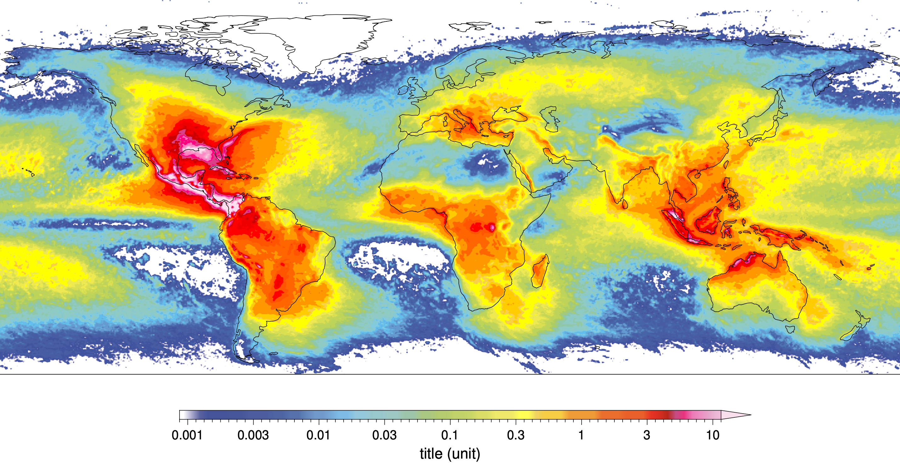

# NetCDF data (raster) mapping with Generic Mapping Tools in Linux environment

The Generic Mapping Tools (GMT) is a powerful open-source plotting and mapping program that you can easily plot in raster and vector formats. It is especially robust when you have large raster files, such as netCDF file that stores multiple dimensional data. This tutorial will demonstrate how to use GMT to visualize climate data. This chapter will show you 3 basic ways of displaying climate data, including global maps of climatological mean, multi-year mean and multi- year monthly mean, using a free lightning dataset (WGLC lightning dataset, can be downloaded in https://zenodo.org/record/4882792#.Yk0LJS2w3xR).

